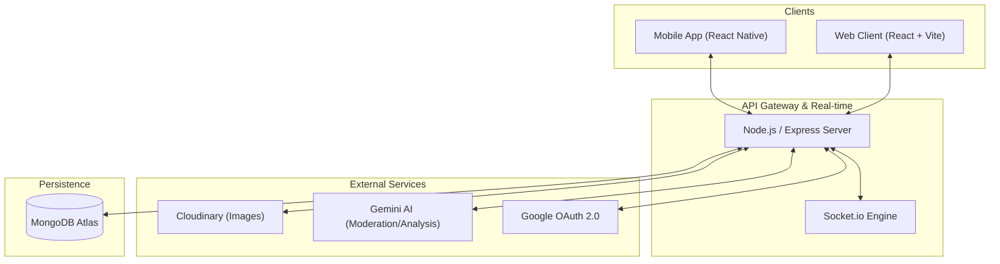
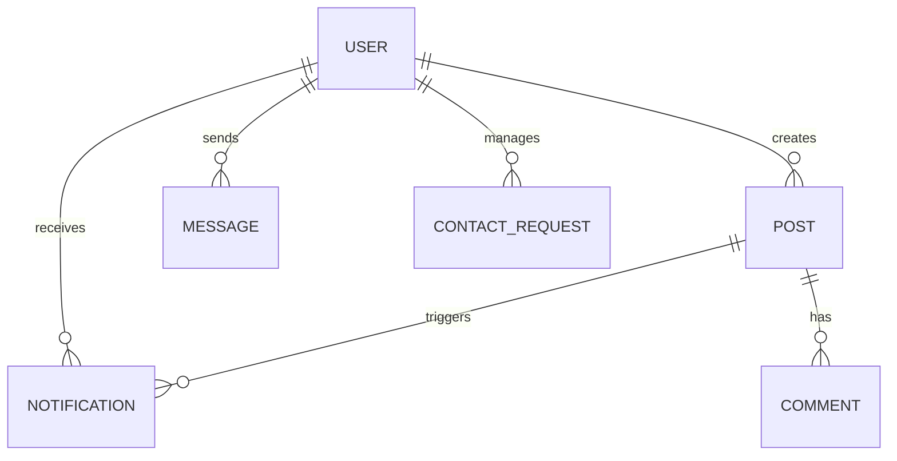
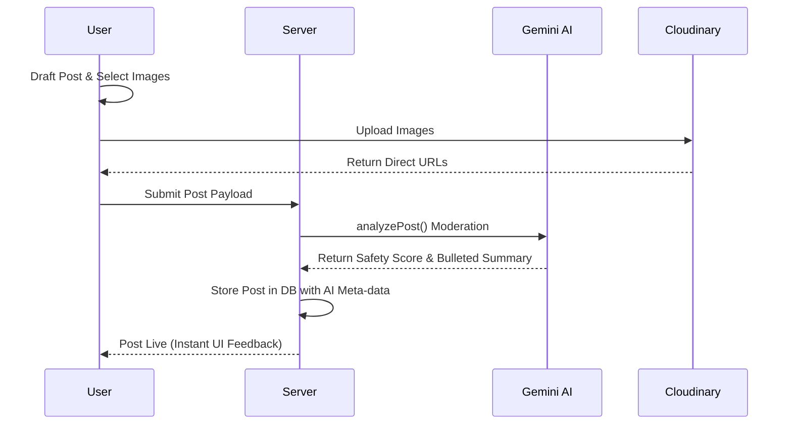

# MyCircle: Hyperlocal Exchange Reimagined
## Comprehensive System Documentation & Technical Blueprint

---

## 1. Executive Summary & Problem Mission
### 1.1 The Aim
**MyCircle** is a community-first hyperlocal marketplace designed to bridge the gap between digital convenience and physical proximity. Unlike generic global marketplaces, MyCircle focuses on building trust within neighborhoods by facilitating the exchange of tasks, services, and goods through a visually premium and technically robust platform.

### 1.2 The Problem We Solve
Existing platforms often suffer from:
- **Lack of Trust**: Anonymity leads to scams and poor-quality interactions.
- **Complexity**: Cluttered interfaces make local trading cumbersome.
- **Low Engagement**: "Ghost" postings that are never updated or expired.
- **Niche Fragmentation**: Users have to toggle between apps for "jobs" vs "selling" vs "renting".

### 1.3 How MyCircle is Different
- **Contextual Intelligence**: Uses AI to moderate content, summarize long posts for quick reading, and provide safety insights.
- **Unified Ecosystem**: A single "Circle" for finding a plumber, renting a ladder, or selling a desk.
- **Real-Time Heartbeat**: Instant notifications and chat ensure local connections happen at the speed of life.
- **Premium Aesthetics**: A "Dark Mode First" design system that feels like a modern SaaS rather than a classifieds board.

---

## 2. System Architecture
MyCircle follows a classic **MERN-based Cloud-Native architecture** with an extended mobile ecosystem.

### 2.1 Technology Stack
| Layer | Technology | Key Usage |
| :--- | :--- | :--- |
| **Backend** | Node.js / Express | RESTful API, Routing, Business Logic |
| **Database** | MongoDB | Document-based storage, 2dsphere indexing |
| **Real-time** | Socket.io | Live chat, Instant Notifications |
| **AI Integration** | Google Gemini | Content moderation, Post Insights |
| **Mobile** | React Native | iOS/Android native parity |
| **Web** | React (Vite) | High-performance dashboard, Public Feed |
| **Styling** | Tailwind / NativeWind | Utility-first, unified design system |
| **Auth** | Passport.js / JWT | Secure Google-only onboarding |

---

## 3. Database Design
The schema is optimized for **Geo-spatial discovery** and **Social engagement**.

### 3.1 Entity Relationship Diagram (ERD)

### 3.2 Core Schemas (MongoDB)
#### **User Model** (`src/models/User.js`)
- `googleId`: Unique identifier for OAuth.
- `stats`: Tracks total posts, active posts, and tasks completed.
- `skills`: Array of tags for professional service discovery.
- `rating/reviews`: Reputation management system.

#### **Post Model** (`src/models/Post.js`)
- `locationCoords`: GeoJSON point for "Near Me" filtering using `2dsphere` index.
- `type`: `job`, `service`, `sell`, `rent`, `barter`.
- `status`: Lifecycle tracking (`active`, `sold`, `archived`).
- `engagement`: Counters for views, likes, and shares.

---

## 4. System Workflows
### 4.1 Onboarding & Authentication
Step-by-step flow for secure user entry:
1. **Request**: User triggers "Login with Google".
2. **Identification**: Google returns a secure ID Token to the client.
3. **Verification**: Backend validates the token using `google-auth-library`.
4. **Synchronization**: Server syncs profile data (Name, Avatar) from Google to the local User document.
5. **Authorization**: A signed JWT is issued to the client for subsequent API requests.

### 4.2 Content Lifecycle (AI-Enhanced)

---

## 5. File Structure
The codebase is structured for scalability and separation of concerns.

### 📁 `MyCircleServer` (The API Engine)
- `src/controllers/`: Business logic for each resource.
- `src/models/`: Single source of truth for database schemas.
- `src/routes/`: RESTful path mapping.
- `src/middleware/`: Global error handling and security guards.

### 📁 `MyCircleClient` (Web Frontend)
- `src/components/ui/`: Atomic UI design system components.
- `src/pages/`: Page-level components managed by React Router.
- `src/services/`: Axios API clients and utilities.

### 📁 `MyCircleMobileBare` (Native Mobile)
- `src/screens/`: Navigation targets for Expo/React Native.
- `src/context/`: Mobile-specific state like `SocketContext` for push-like notifications.
- `android/` & `ios/`: Native configuration for deep-linking and build settings.

---

## 6. Functional Features
### 🚀 Core Marketplace
- **Dynamic Feed**: Real-time discovery of nearby exchange opportunities.
- **Advanced Filters**: Search by category, price range, or post status.
- **Barter Toggle**: Unique feature to enable item-for-service or item-for-item trading.

### 💬 Real-Time Interaction
- **Smart Chat**: Live messaging with AI-suggested quick replies.
- **Push-Style Notifications**: Powered by `Socket.io` and `Notifee` for instant mobile alerts.
- **Contact Request Flow**: Users "Request Contact", and only when "Approved" are Phone/WhatsApp links visible.

### 🤖 AI Utilities
- **Auto-Moderation**: Ensures community guidelines are met before a post goes live.
- **Post Insights**: Summarizes long descriptions into actionable bullet points.
- **Chat Suggestions**: Assists users in professional negotiation.

---

## 7. Operational Design
- **Dark Mode First**: Optimized for visual premium and battery efficiency on mobile OLED screens.
- **Glassmorphism**: Modern UI aesthetic across both Web and Mobile platforms.
- **Performance**: Lazy loading for images and list virtualization for long feeds.

---
**Document Status**: *Final v1.0*
**Author**: Antigravity Technical Assistant
